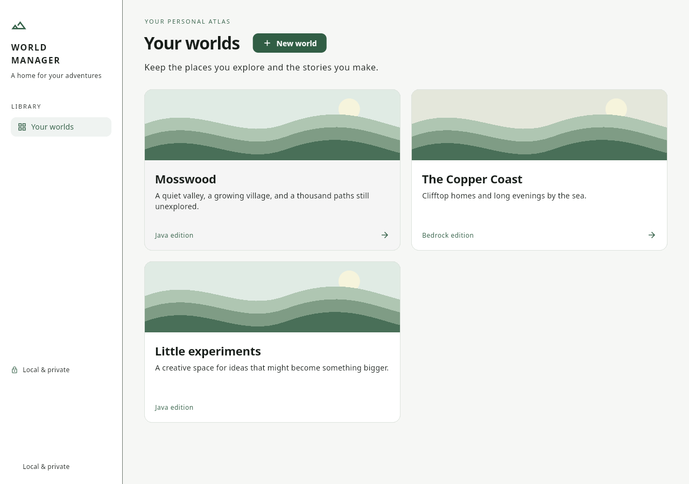

# Minecraft World Manager

An offline Flutter companion for Minecraft. The first milestone supports a world
 dashboard, overview, create/edit/delete, and local SQLite persistence.

## Verified in this cloud environment

- Linux release build succeeded.
- Static analysis passed with no issues.
- Seven tests passed: disk CRUD/reopen, invalid data handling, UI CRUD, and
  narrow/wide layouts in light/dark themes with enlarged text.
- The compiled desktop app created a world through its UI. After stopping and
  restarting the process, the world appeared again on its dashboard.

Android, iOS, macOS and Windows runners are generated but those platforms have
not been built or tested in this cloud environment. The user reported the original
macOS app running locally; the redesigned macOS build awaits local verification. This is the world-management foundation, not the full MVP.

## Design preview



The illustrated landscapes are decorative placeholders; your saved worlds and
notes remain local.

## Cloud development commands

```bash
cd /workspace/minecraft-world-manager
source /workspace/cloud-setup/env.sh
flutter pub get --enforce-lockfile
# Regenerate database code after intentional schema changes:
dart run build_runner build
flutter analyze
flutter test
flutter build linux --no-tree-shake-icons
flutter run -d linux
```

A graphical display is required to view the application. For internal headless
validation, start Xvfb and run the compiled application:

```bash
source /workspace/cloud-setup/env.sh
Xvfb :99 -screen 0 1280x900x24 -nolisten tcp &
export DISPLAY=:99
export XDG_DATA_HOME=/workspace/smoke-data
cd /workspace/minecraft-world-manager
./build/linux/x64/release/bundle/minecraft_world_manager
```

Use a separate `XDG_DATA_HOME` for smoke checks to preserve personal app data.
Stop only processes you started when done. No web preview is provided.

## On your own computer

Install Flutter stable and your platform's native build prerequisites, then run:

```bash
flutter pub get --enforce-lockfile
flutter analyze
flutter test
flutter run -d <device-id>
```

Linux requires clang, CMake, Ninja, pkg-config and GTK development headers.
Windows requires Visual Studio C++ build tools. Apple builds require macOS/Xcode;
Android requires the Android SDK and compatible JDK. Use `flutter doctor` and
`flutter devices` to inspect your machine. Cloud-specific paths above are not
required on your own computer.

SQLite lives in the OS application-support directory; seeds and accounts are not
required. See [development notes](docs/DECISIONS.md) for architecture and next steps.
